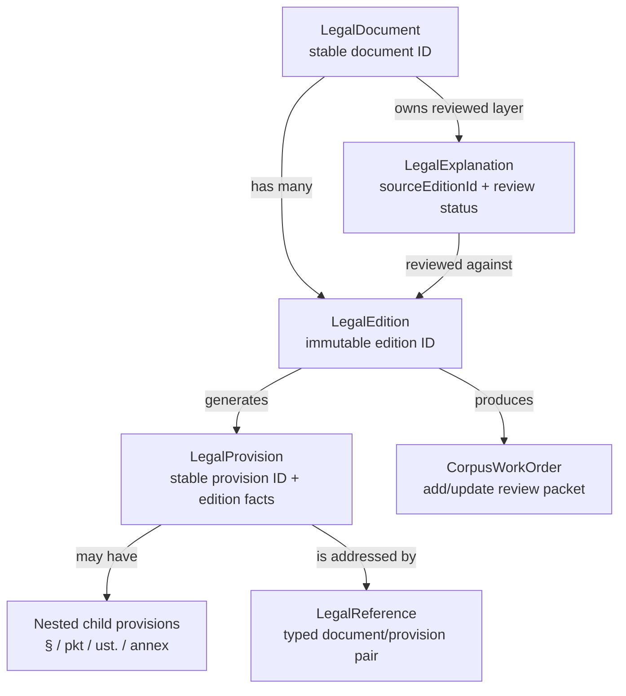
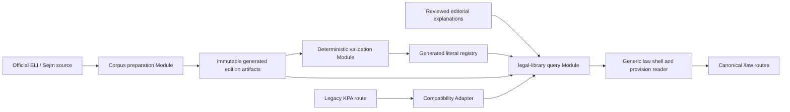
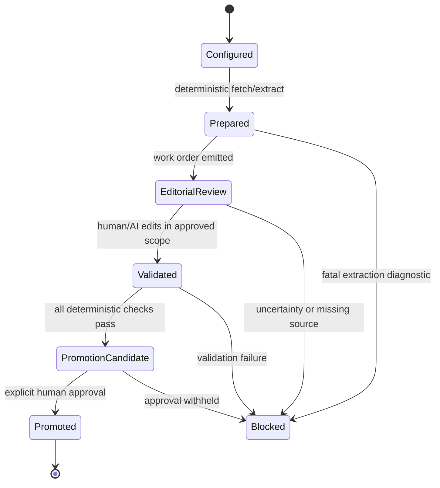

# Multi-document legal library architecture

**Status:** implemented source of truth; phases 1–6 active as of 2026-07-15

**Scope:** maintain the local, versioned multi-document library without changing the legal-source or editorial safety rules.

**Audience:** the implementer of the corpus pipeline, the library data module, routes, and the editorial workflow.

This document defines the active architecture. The repository now has generic corpus profiles, generated typed registries, the `legal-library` query Module, canonical `/law` routes, KPA compatibility, and the deterministic review/promotion workflow. Sections describing the former KPA-only state remain as migration history.

## 1. Purpose and governing invariants

The library must let a learner move from an official act to a useful, reviewed explanation while keeping these things separate:

1. the legal instrument itself;
2. an immutable official edition of that instrument;
3. generated facts extracted from that edition;
4. reviewed educational content; and
5. a URL or code reference to an addressable provision.

The official PDF remains the visual source of truth. Extracted text is a locator and learning aid. It is never a replacement for checking the PDF or the official ELI page.

The library is an educational tool, not an automated decision system or individual legal advice. Legal content is written in Ukrainian with the Polish legal terms preserved (`Art.`, `paragraf`, `wezwanie`, `odwołanie`, and so on). Every explanation must state whether a sentence is the statute text, official guidance, case law, or a practical inference.

### Non-negotiable invariants

- `LegalDocumentId` identifies the act or instrument as a stable concept. It is not an edition ID.
- `LegalEditionId` identifies one immutable source edition. It is used for generated source artifacts and never silently changes.
- A public ordinary reference contains the stable document and provision IDs. An edition is added only when a historical or source-specific reference needs it.
- A `LegalProvision` is generic. An article is one provision kind; paragraphs, sections, points, annexes, and nested locators are also supported.
- Generated corpus facts and reviewed explanations have different files, owners, and validation rules. A corpus rebuild never overwrites an explanation.
- Callers use the `legal-library` query/resolution Module. A route or component must not import a document's JSON files directly.
- Compile-time unions protect code written in TypeScript; runtime guards protect parsed URLs, stale generated files, and external data.
- A new edition is not current merely because it was fetched, built, or reviewed by an AI. Promotion is an explicit human-approved operation.
- A changed source hash triggers review. An unchanged source hash does not prove an unchanged legal effect.
- The generic shell provides navigation and source reading. It does not force every act to have the same learning or practice structure.

## 2. Current state and constraints

The current KPA implementation is valuable evidence, not the target public contract:

| Current implementation | Constraint for the target |
| --- | --- |
| `scripts/legal-corpus/build-document.mjs` fetches ELI metadata and a PDF, normalizes pages, and detects `Art.` with one regular expression. | Keep deterministic extraction, but generalize its output from articles to provisions and record diagnostics. Do not add parser Adapter layers before a second format exists. |
| `legal-corpus/documents/kpa-2025-1691.json` uses `id` as the edition directory identifier. | Add explicit stable `documentId`, `editionId`, `schemaVersion`, source provider, and extraction expectations. Accept the old shape only through a migration reader. |
| `app/data/legal-corpus/` contains generated manifests and provision facts for all registered documents and editions. | Generate one literal registry for all documents and editions. Keep manifest parsing inside the library Implementation. |
| `app/data/legal-library/learning/kpa.ts` owns the KPA learning projection; corpus facts provide article identity, order, status, and PDF locators while authored metadata supplies learner labels. | Keep the compatibility shape inside the canonical KPA learning module and move shared navigation to generic provision/structure queries. |
| `app/data/legal-library/editorial/kpa/` contains reviewed lazy-loaded explanations keyed by stable provision IDs. | Preserve its editorial quality, and record `sourceEditionId`, `verifiedAt`, and review status. |
| The legal-library query projects generated provision text and PDF locators for every document. | Keep source text behind generic corpus queries; the official PDF remains the trust source. |
| `app/components/kpa-articles-content.tsx` provides the exact-PDF-page dialog, ELI link, source text, explanation, and previous/next controls. | Preserve these UX strengths in a generic provision reader. Its current hardcoded KPA labels and source ID move behind the query Module. |
| `app/routes/kpa.tsx` owns `view`, `article`, and `module` query semantics. | Keep a route compatibility Adapter for all known deep links while `/law` becomes canonical. |
| `app/data/legal-references.ts` assumes an article is KPA unless context says otherwise. | Replace the string article reference with a document-dependent `LegalReference` and a runtime resolver. |
| `app/routes.ts` exposes `/guide/kpa`. | Add the `/law` route family without breaking existing URLs. |

The current deterministic checks are `npm.cmd run typecheck` and `npm.cmd run build`. There is no configured test runner. Target corpus commands listed below are plans, not existing commands.

## 3. Architecture vocabulary

These terms have precise meanings in this document:

| Term | Meaning in this architecture | Example |
| --- | --- | --- |
| **Module** | A unit with one coherent responsibility and a small Interface. Its internal files and data format are private to the Module. | `legal-library` owns lookup, reference resolution, and safe fallback. |
| **Interface** | The stable shape a Module promises to its callers. It includes inputs, outputs, invariants, and error behavior. | `getProvision(documentId, provisionId, editionId?)`. |
| **Implementation** | The code and generated data that satisfy an Interface. It may change without changing callers. | The query Implementation may move from JSON imports to generated chunks. |
| **Depth** | Leverage at the Interface: how much useful behavior callers receive for the amount of contract they must learn. A deep Module hides source selection, version checks, lookup, and safe fallback behind a small Interface. | The `legal-library` Module earns Depth when callers need only `getProvision` or `resolveLegalReference`, rather than learning per-act JSON, parser, and fallback rules. |
| **Seam** | An intentional point where two contracts can be changed independently. A Seam needs a real difference in input or ownership; it is not an excuse for a speculative abstraction. | The legacy KPA URL and the canonical `/law` URL have a route Adapter Seam. |
| **Adapter** | A small translation Implementation at a Seam. It preserves an old contract while delegating to the new one. | `legacyKpaRouteAdapter` maps `article=42a` to `kpa-art-42a`. |
| **Leverage** | Reuse gained when one well-defined Module handles many documents without copying document-specific code. | One provision reader can show KPA and `ustawa-o-cudzoziemcach`. |
| **Locality** | Keeping a change close to the data or Module that owns it. Document-specific extraction quirks and explanations stay with that document/profile. | A KPA locator override does not spread through the route shell. |

A Seam is deliberately named as a Seam. It is not a reason to introduce a generic parser or a separate runtime system before there are two real formats.

## 4. Canonical domain model

### 4.1 Six distinct concepts

#### `LegalDocument`

The act or instrument as a stable legal concept: for example, `Kodeks postępowania administracyjnego` or `ustawa o cudzoziemcach`. It owns the stable `LegalDocumentId`, display metadata, and the list of known editions. It is not the text of one publication.

#### `LegalEdition`

One immutable official text version, such as `kpa-2025-1691`. It records the official citation, source URLs, PDF checksum, checked date, legal-status date, in-force information, extraction profile, and build diagnostics. A new official text creates a new edition record; an old edition is retained rather than rewritten.

#### `LegalProvision`

One addressable unit in one edition. It has a stable URL-safe ID, a display locator, a provision kind, parent and child IDs, order, PDF start and end pages, status, normalized source text, and a normalized source-text hash. `Art. 2a § 1 pkt 3` may be represented as an article with paragraph and point children, while a regulation may start at `§ 1` and an instrument may contain an annex.

The provision ID is stable across editions when the conceptual provision remains the same. The ID is not generated from an array index. A locator override table is allowed for a genuine renumbering or split/merge, and every override must be explicit and reviewed.

#### `LegalExplanation`

The reviewed educational layer for a stable document/provision pair. It contains Ukrainian explanation with Polish terms, legal-effect and practical context, source claims, and editorial status. It records `sourceEditionId`, `verifiedAt`, and `reviewStatus`. It can be marked stale or superseded when a source changes. It is never generated by extracting the PDF and is never overwritten by a corpus build.

#### `LegalReference`

A typed pointer to a document, provision, map node, case route, or external official source. A provision reference must pair a document ID with a provision ID from that document. The pair is checked both by TypeScript and at runtime.

#### `CorpusWorkOrder`

A deterministic review packet for adding a document or updating an edition. It names the mode, identities, official sources, changed provisions, diagnostics, legal-state date, and approved write scope. It is input to human/AI editorial review; it does not itself promote an edition.

### 4.2 Relationship diagram



### 4.3 Identity and version rules

1. Use semantic IDs in code and ordinary URLs: `kpa`, `ustawa-o-cudzoziemcach`, `powierzanie-pracy`, and `ppsa` are examples of `LegalDocumentId` values.
2. Use immutable edition IDs in generated paths and source artifacts: `kpa-2025-1691` is an example of a `LegalEditionId`.
3. Do not make a document ID from the current citation, because a citation change would break ordinary links.
4. Do not make a provision ID from its position in an array. Prefer a document-scoped canonical locator (`kpa-art-42a`, `cudzoziemcy-art-60`) and retain explicit overrides for exceptional changes.
5. A source artifact path contains the edition ID, for example `public/legal-sources/kpa-2025-1691/source.pdf`. This prevents one edition from overwriting another.
6. A reviewed explanation is addressed by the stable document/provision pair and records the edition it was checked against. If it is not verified for the requested edition, the reader shows source facts plus a visible review status instead of silently using a newer or older explanation.
7. A source hash is evidence for extraction comparison, not a legal conclusion. A hash may change because of PDF formatting, OCR/extraction noise, or a real amendment.

## 5. Generated TypeScript registry and reference safety

After deterministic ingestion and validation, generation commits a TypeScript registry with `as const`. The registry is the type-level index for known IDs; it is not a replacement for runtime validation. The real generated file will contain all provisions, not only the small illustrative lists below.

```ts
// Generated: do not edit by hand. The lists below are deliberately abbreviated.
export const legalLibraryRegistry = {
  kpa: {
    currentEditionId: "kpa-2025-1691",
    editionIds: ["kpa-2025-1691"],
    provisionIds: ["kpa-art-1", "kpa-art-2", "kpa-art-2a"],
  },
  "ustawa-o-cudzoziemcach": {
    currentEditionId: "ustawa-o-cudzoziemcach-2025-1079",
    editionIds: ["ustawa-o-cudzoziemcach-2025-1079"],
    provisionIds: ["cudzoziemcy-art-1", "cudzoziemcy-art-7"],
  },
  "powierzanie-pracy": {
    currentEditionId: "powierzanie-pracy-2025-621",
    editionIds: ["powierzanie-pracy-2025-621"],
    provisionIds: ["praca-art-1", "praca-art-5"],
  },
  ppsa: {
    currentEditionId: "ppsa-2026-143",
    editionIds: ["ppsa-2026-143"],
    provisionIds: ["ppsa-art-1", "ppsa-art-3"],
  },
} as const

type Registry = typeof legalLibraryRegistry
export type LegalDocumentId = keyof Registry
export type LegalProvisionId<D extends LegalDocumentId> =
  Registry[D]["provisionIds"][number]
export type LegalEditionId<D extends LegalDocumentId> =
  Registry[D]["editionIds"][number]

type ProvisionReference<D extends LegalDocumentId> = {
  kind: "legal-provision"
  documentId: D
  provisionId: LegalProvisionId<D>
  editionId?: LegalEditionId<D>
}

// This mapped/distributive union keeps each document ID paired with its own
// provision and edition unions. Do not replace it with three independent
// string unions.
type LawReference =
  | { [D in LegalDocumentId]: ProvisionReference<D> }[LegalDocumentId]
  | { kind: "legal-document"; documentId: LegalDocumentId }

// Official pages and guidance use stable semantic keys as well. Call sites do
// not pass arbitrary URLs when the source is part of the maintained library.
export const officialSourceRegistry = {
  "eli-kpa-current": {
    url: "https://eli.gov.pl/eli/DU/2025/1691/ogl",
    label: "Kodeks postępowania administracyjnego — ELI",
  },
  "udsc-mos-qa": {
    url: "https://www.gov.pl/web/udsc/mos-qa",
    label: "UdSC — MOS pytania i odpowiedzi",
  },
} as const

export type OfficialSourceId = keyof typeof officialSourceRegistry

type OfficialSourceReference = {
  kind: "official-source"
  sourceId: OfficialSourceId
}

// Existing typed map-node, case-route, and document-catalog branches compose
// with this union from their own literal registries; they are not represented
// as unvalidated strings here.
export type LegalReference = LawReference | OfficialSourceReference

const valid: LegalReference = {
  kind: "legal-provision",
  documentId: "kpa",
  provisionId: "kpa-art-2a",
  editionId: "kpa-2025-1691",
}

const invalidDocumentProvisionPair: LegalReference = {
  kind: "legal-provision",
  documentId: "kpa",
  // TypeScript error: "cudzoziemcy-art-1" is not a KPA provision ID.
  provisionId: "cudzoziemcy-art-1",
}

const invalidDocumentEditionPair: LegalReference = {
  kind: "legal-provision",
  documentId: "kpa",
  provisionId: "kpa-art-1",
  // TypeScript error: this edition belongs to another document.
  editionId: "ustawa-o-cudzoziemcach-2025-1079",
}
```

The two invalid declarations are intentionally non-compiling examples. If they are placed in a typechecked fixture, they must be annotated with `@ts-expect-error`; removing the annotations must make `tsc` fail. A plain union such as `documentId: LegalDocumentId; provisionId: AllProvisionIds` would incorrectly accept both pairs.

The maintained official-source registry is hand-authored or generated from canonical source metadata and validated together with the law registry. `OfficialSourceLink` receives an `OfficialSourceReference`; the resolver supplies its URL and label. Truly ad hoc external URLs use a separately named escape hatch, are HTTPS-validated at runtime, and do not pretend to be registry-safe. Existing map-node and case-route references compose into the application-wide `LegalReference`. Evidence documents use the distinct stable `EvidenceDocumentId` and `evidence-document` reference defined in [`document-library.md`](./document-library.md); title hashes and ambient prose matching are not public identity or navigation contracts.

Legacy string article values remain only in a compatibility type and Adapter. New code uses `LegalReference`:

```ts
type LegacyKpaArticleReference = {
  kind: "legacy-kpa-article"
  article: string
}

// The adapter resolves this at runtime through the generated legacy alias map.
// It is not part of ordinary new references.
```

## 6. Target module graph



### 6.1 Module responsibilities

| Module | Owns | Must not own |
| --- | --- | --- |
| Corpus preparation | Fetching pinned official metadata/PDF, normalization, profile extraction, hashes, diagnostics, edition artifacts, work-order input. | Educational prose, current-edition promotion, route behavior. |
| Source profile | The extraction rules for one known document format. | Editorial interpretation or cross-document references. |
| Corpus validation | Schema, identity, source checksum, locator coverage, hierarchy, hash, registry, and explanation-key checks. | Deciding what a legal provision means. |
| Generated registry | Literal document, edition, and provision unions plus validated document metadata. | Runtime guesses or hand-authored explanations. |
| `legal-library` query/resolution | Safe lookup, current-edition selection, provision order, explanation loading, reference resolution, and fallback results. | Parsing PDF text or writing generated files. |
| Editorial explanation layer | Reviewed Ukrainian explanations, claim labels, source-edition provenance, review status, and lazy loading. | Replacing source text or inventing locators. |
| Canonical law shell | Catalog, document overview, provision reader, source dialog, previous/next, and document-specific module/practice navigation. | Assuming all documents share KPA's learning sections. |
| Legacy KPA route Adapter | Mapping old `/guide/kpa` query parameters and article labels to stable IDs and canonical routes. | Becoming a second KPA data store. |

#### Internal query implementation split

The compatibility module `app/data/legal-library/query.ts` remains the public query
facade and preserves all existing direct imports and overloads. Its implementation is
split into three one-way layers:

- `corpus-parsing.ts` owns unknown-value guards plus manifest and provision parsing;
- `domain-construction.ts` owns generated-registry access, explicit current-edition
  selection, raw lookups, `LegalDocument`/`LegalEdition`/`LegalProvision` construction,
  and canonical PDF locators;
- `query.ts` owns ID/reference parsing and guards, list/get/navigation queries,
  resolution statuses, aliases, and lazy editorial explanation resolution. It
  re-exports the corpus parsers and PDF locator APIs for compatibility.

The dependency direction is corpus parsing → domain construction → public query;
editorial loading is used only by the public query layer. The barrel's exported symbol
set is unchanged.

### 6.2 `legal-library` Interface

The deep query/resolution Module has one small Interface. Callers import this Interface, never `articles.json`, `pages.json`, an edition manifest, or a per-document explanation file.

```ts
export interface LegalLibrary {
  getDocument(documentId: LegalDocumentId): LegalDocument | undefined

  getEdition<D extends LegalDocumentId>(
    documentId: D,
    editionId?: LegalEditionId<D>,
  ): LegalEdition<D> | undefined

  getProvision<D extends LegalDocumentId>(
    documentId: D,
    provisionId: LegalProvisionId<D>,
    editionId?: LegalEditionId<D>,
  ): LegalProvision<D> | undefined

  getExplanation<D extends LegalDocumentId>(
    documentId: D,
    provisionId: LegalProvisionId<D>,
    editionId?: LegalEditionId<D>,
  ): LegalExplanationResolution

  resolveLegalReference(
    reference: LegalReference,
  ): LegalReferenceResolution
}
```

The actual Implementation may add an internal `parseLegalReference(input: unknown)` function for URLs and external data. That parser validates IDs before calling the Interface. `LegalReferenceResolution` should distinguish at least `resolved`, `unknown-document`, `unknown-edition`, `unknown-provision`, `mismatched-provision`, `missing-explanation`, and `stale-explanation` rather than returning an arbitrary fallback.

#### Query invariants

- `getDocument` returns only a registered stable ID.
- `getEdition(documentId, editionId)` never returns an edition from another document. With no explicit edition, it uses the registry's explicit `currentEditionId`; it does not infer current status from a filename.
- `getProvision` validates the document/provision pair and edition. It never substitutes a provision with the same display locator from another act.
- `getExplanation` validates the requested edition against `sourceEditionId` and an explicit compatibility record. It returns a reviewed match, a visibly stale/incompatible result, or no explanation. A historical reader never receives prose verified only for another edition as though it matched. The UI falls back to source text and a review-pending state; it does not create prose at runtime.
- `resolveLegalReference` performs the same checks after values have crossed a URL, JSON, or other runtime input.
- A historical explicit edition is never silently replaced by the current edition.
- Runtime fallback is safe and visible: unknown IDs produce a 404 or unresolved-reference state; missing editorial content falls back only to generated source facts.

## 7. Source configuration and extraction profiles

### 7.1 Versioned configuration schema

The current KPA configuration is a useful input but its `id` is really an edition ID. The target schema makes both identities explicit and is versioned:

```json
{
  "schemaVersion": 2,
  "documentId": "kpa",
  "editionId": "kpa-2025-1691",
  "shortName": "KPA",
  "title": "Kodeks postępowania administracyjnego",
  "citation": "Dz.U. 2025 poz. 1691",
  "source": {
    "provider": "eli",
    "officialPageUrl": "https://eli.gov.pl/eli/DU/2025/1691/ogl",
    "metadataUrl": "https://api.sejm.gov.pl/eli/acts/DU/2025/1691",
    "pdfUrl": "https://eli.gov.pl/api/acts/DU/2025/1691/text/T/D20251691L.pdf"
  },
  "checkedAt": "2026-07-14",
  "legalStateDate": "2026-07-14",
  "extraction": {
    "profile": "polish-statute-art-v1",
    "expectedProvisionCount": 306,
    "expectedTextCoverage": 0.98,
    "expectedPageCount": 46
  }
}
```

Required fields:

- `schemaVersion`: migration and validation discriminator;
- `documentId`: stable semantic ID;
- `editionId`: immutable source ID and artifact directory name;
- title, short name, citation, publisher metadata where available;
- `source.provider` and all official URLs;
- `checkedAt`: when the source was checked;
- `legalStateDate`: the legal-state date shown to a learner;
- `extraction.profile`: a named profile, not a free-form regex;
- expected count/coverage/page checks, with explicit tolerances where a source makes exact counts impossible.

The reader for schema version 1 may map `id` to `editionId` and require an explicit `documentId` supplied by a migration map. It must not guess a stable document ID from a display title once multiple acts are present. New configurations use version 2. A schema migration writes a new config; it does not rewrite an old edition's generated facts.

### 7.2 Deterministic extraction

The target preparation flow keeps the current builder's useful stages:

1. fetch the pinned metadata and PDF from the configured official URLs;
2. verify HTTP success, content type, and PDF checksum;
3. extract one-based page text with the existing normalization policy;
4. run the named extraction profile;
5. construct provision hierarchy, status, order, page ranges, and normalized source hashes;
6. compare expected counts and coverage;
7. write diagnostics and artifacts to a staging directory;
8. publish the immutable edition artifacts only after validation succeeds.

Before publication, validation also checks that each promoted page locator is integer-bounded by the manifest page count and bound to the same PDF checksum as the edition manifest.

The current profile is an internal `polish-statute-art-v1` extraction implementation based on `Art.` locators. It should produce article, paragraph, point, and nested records where the text supports them. It must preserve the exact display locator even when a locator contains `a`, a superscript, `ust.`, `pkt`, or another nested marker.

Only introduce a parser Adapter Seam when there are actually two formats with materially different locator rules. Start with internal named extraction profiles. Likely future profiles are:

- Polish statutes (`Art.`-led provisions);
- paragraph-led Polish regulations (`§`-led provisions);
- EU instruments with their own article/recital/annex conventions.

When the second format is accepted, extract a small profile Interface around the shared facts (`detect`, `extract`, `diagnostics`) and add an Adapter for each genuinely different format. Until then, one profile Implementation with named internal functions has better Locality and avoids a speculative Seam that provides no additional Leverage.

### 7.3 Provision fact shape

The generic output must contain at least these fields:

```json
{
  "id": "kpa-art-2a",
  "documentId": "kpa",
  "editionId": "kpa-2025-1691",
  "kind": "article",
  "locator": "Art. 2a",
  "parentId": null,
  "childIds": ["kpa-art-2a-par-1", "kpa-art-2a-par-2", "kpa-art-2a-par-3"],
  "order": 3,
  "startPdfPage": 2,
  "endPdfPage": 2,
  "status": "active",
  "sourcePdfSha256": "sha256:...",
  "sourceTextHash": "sha256:...",
  "text": "Art. 2a. ..."
}
```

A nested record can look like this:

```json
{
  "id": "kpa-art-2a-par-1",
  "documentId": "kpa",
  "editionId": "kpa-2025-1691",
  "kind": "paragraph",
  "locator": "Art. 2a § 1",
  "parentId": "kpa-art-2a",
  "childIds": [],
  "order": 3.1,
  "startPdfPage": 2,
  "endPdfPage": 2,
  "status": "active",
  "sourcePdfSha256": "sha256:...",
  "sourceTextHash": "sha256:...",
  "text": "§ 1. ..."
}
```

`order` is for display and previous/next navigation, not identity. The implementation may use a sortable path string instead of a floating number; it must preserve deterministic ordering. `status` must support at least `active`, `repealed`, `reserved`, `removed`, and `unknown`, with the source evidence or diagnostic explaining non-active states.

For every promoted provision, `startPdfPage` and `endPdfPage` are one-based integers satisfying `1 ≤ startPdfPage ≤ endPdfPage ≤ manifest.pageCount`, and `sourcePdfSha256` must equal the edition manifest checksum. The canonical reader locator is `<localPdfUrl>#page=<startPdfPage>&zoom=page-width`; a multi-page range is displayed as metadata but the dialog starts at the first page. The locator builder lives inside the query/resolution Implementation so callers cannot construct fragments inconsistently.

Do not invent a locator when extraction is ambiguous. Emit a diagnostic and leave the provision out of the promoted index until a human resolves it against the PDF. A missing locator is safer than a plausible but false URL.

## 8. Generated artifacts and ownership

Generated files are committed application inputs, not hand-maintained editorial files. The exact directory can be finalized during implementation, but the following target layout is canonical enough for callers and scripts:

```text
legal-corpus/
  documents/
    kpa-2025-1691.json                 # immutable edition config
    ...
  prompts/
    add-or-update-document.md           # reusable review prompt
  work-orders/
    <documentId>-<newEditionId>.md      # generated review packet, if committed

app/data/legal-corpus/
  <editionId>/
    manifest.json                       # source + build facts
    metadata.json                       # original official metadata response
    pages.json                          # one-based page text and coverage
    provisions.json                     # generic addressable provision facts
    structure.json                      # deterministic parent/child/order tree
    diagnostics.json                    # warnings and fatal issues
    edition-diff.json                   # update classification, when applicable
  registry.ts                           # generated `as const` type/runtime index

app/data/legal-library/
  contracts.ts                          # hand-authored public types
  query.ts                              # hand-authored query/resolution Implementation
  editorial/
    <documentId>/                       # reviewed explanations, lazy-loadable
      <provision-id>.ts

public/legal-sources/
  <editionId>/
    source.pdf                          # immutable official visual source
    manifest.json                       # optional reader-facing manifest copy
```

The current `app/data/legal-corpus/kpa-2025-1691/{manifest,metadata,pages,articles}.json` and `public/legal-sources/kpa-2025-1691/source.pdf` remain readable during migration. `articles.json` becomes a generated compatibility projection from `provisions.json`; it is not edited or treated as the generic model.

### Artifact contract

| Artifact | Generated facts and use | Replacement/compatibility rule |
| --- | --- | --- |
| `manifest.json` | IDs, citation, URLs, dates, checksums, page/provision counts, profile, build facts, ELI status. | Keep one immutable manifest per edition. |
| `metadata.json` | Original official ELI/API response for audit and source verification. | Never synthesize it from an explanation. |
| `pages.json` | One-based normalized page text, character count, text-layer flag. | Retain for exact page lookup and diagnostics. |
| `provisions.json` | Generic provision records, hierarchy links, page span, status, text, hash. | Canonical generated provision facts. |
| `structure.json` | Ordered tree or adjacency lists of provision IDs and display groups. | Keeps navigation separate from source text. |
| `registry.ts` | Literal `LegalDocumentId`, `LegalEditionId`, document-dependent provision unions, current-edition pointers, and basic metadata. | Regenerate after validation; never hand edit. |
| `diagnostics.json` | Fatal/warning codes, extraction ambiguities, expected-vs-observed counts, missing coverage. | A non-empty fatal diagnostic blocks promotion. |
| `edition-diff.json` | Added/changed/removed/unchanged IDs and review dependants for an update. | Generated only from two immutable editions. |
| `articles.json` | Temporary KPA-shaped projection for existing selectors/readers. | Generated from provisions during migration, then retired. |
| `source.pdf` | Official visual source used by the reader. | Path is keyed by edition ID and never overwritten. |

The query Module is the only Application-facing importer of these artifacts. It may lazy-load explanations by document/provision, but it must not expose arbitrary JSON paths to components.

## 9. Editorial explanation model

A target explanation module should have a shape similar to:

```ts
export const explanation = {
  id: "kpa/kpa-art-2a",
  documentId: "kpa",
  provisionId: "kpa-art-2a",
  sourceEditionId: "kpa-2025-1691",
  verifiedAt: "2026-07-14",
  reviewStatus: "reviewed",
  language: "uk",
  claims: [
    {
      kind: "statute-text",
      text: "...",
      sourceLocator: "Art. 2a § 1",
    },
    {
      kind: "practical-inference",
      text: "...",
      sourceLocator: "Art. 2a § 1",
    },
  ],
  legalEffect: "...",
  foreignerCase: "...",
} as const
```

Required behavior:

- `reviewStatus` distinguishes at least `draft`, `reviewed`, `stale`, `blocked`, and `superseded`.
- `sourceEditionId` is mandatory even when the explanation key is stable across editions.
- `verifiedAt` is a verification date, not a promise that the law is current forever.
- Claims distinguish statute text, official guidance, case law, and practical inference. The UI can render these labels without guessing from prose.
- An explanation may reference related provisions by typed IDs. Validation verifies every related ID and every source URL.
- Rebuilding `pages.json`, `provisions.json`, or `registry.ts` does not modify editorial files. A changed or removed provision creates a review task, not an automatic rewrite.
- A stale explanation can remain available as historical learning material only if the reader labels its edition and does not present it as current advice.

Document-specific learning modules and practice content live in the document's editorial package. The generic shell may offer `learn` and `practice` slots, but it must render only the slots that a document declares. KPA's article-by-article guide is not a mandatory template for a regulation, an EU instrument, or a document checklist.

### 9.1 Authored legal citations in learning prose

`app/data/legal-library/learning/legal-text.ts` is the authoring Module for inline legal citations. Its Interface is deliberately small: choose a document once with `createLegalLearningTextAuthor(documentId)`, then compose ordinary prose with `text`, `article`, `articleRange`, `paragraph`, `paragraphRange`, `annex`, `annexRange`, or `document`. Provision arguments are generated-registry literal unions, so an article that does not belong to the selected document cannot compile.

```ts
const workLaw = createLegalLearningTextAuthor("powierzanie-pracy")
const kpaLaw = createLegalLearningTextAuthor("kpa")

workLaw.text`${workLaw.article("6")} визначає модель, але ${kpaLaw.article("64", "art. 64 KPA")} регулює brak formalny.`
workLaw.text`Перевірте ${workLaw.articleRange("30", "39")}.`
```

The tagged template stores text and typed targets as structured parts. The renderer does not parse article numbers and does not infer a target from the active route. A cross-document citation therefore requires the author for that other document. A range renders two links—its head and tail—without generating ten noisy links. Curriculum definition validates plain segments and fails closed on a bare numbered `Art.`, `§`, or `załącznik`; this prevents a new unlinked citation from silently reaching the learning UI.

The deletion test explains the Module's Depth: deleting it would spread template parsing, range presentation, generated-ID typing, cross-act safety, and bare-citation validation back across every curriculum and renderer. Keeping those rules behind one Interface gives both Leverage and Locality.

### 9.2 Evidence-document references

Legal instruments and evidence documents are separate concepts. The Law library owns `LegalDocumentReference`; the Document library owns `EvidenceDocumentReference`. Both may appear in `LegalTextValue`, but each resolves through its own deep Module and canonical registry. See [`document-library.md`](./document-library.md) for identity, routes, typed authoring, compatibility, and migration rules.

### 9.1 Typed-reference preview contract

Every authored `LegalReference` rendered by `LegalLink` or `LegalReferenceArrow` may expose one shadcn `HoverCard`. `app/data/reference-previews.ts` owns the preview contract, while `legal-references.ts` remains a fail-closed navigation resolver and never imports the preview layer.

A preview has a stable identity, bounded title and summary, `status` (`reviewed`, `draft`, or `source-only`), and provenance metadata. Reviewed provision copy comes only from a reviewed `LegalExplanation`. A non-reviewed editorial summary may appear only as visibly labelled `draft`, with its actual review status and only when `sourceEditionId` exactly matches the requested edition. Without matching editorial content, the card uses the exact locator and a bounded generated source-text excerpt. Evidence documents, map nodes, case routes, and official sources reuse their canonical descriptions. Arbitrary HTTPS references remain `source-only`; if the exact URL has unambiguous authored source metadata, the card reuses that label and note. The resolver never infers a provision or creates interpretation.

Resolution is lazy and cached by stable reference identity. Unknown references, malformed URLs, and non-HTTPS values fail closed. Historical editions never borrow editorial prose from another edition. The Base UI trigger remains the real internal `Link` or external anchor, so navigation, `_blank`, keyboard focus, touch behavior, and reduced motion remain unchanged; card content is non-interactive.

`npm.cmd run test:previews` enumerates every registered document and edition provision, evidence document, map node, case route, and official source. It validates reviewed/draft/source-only fallback, known external-source metadata, edition matching, unknown and malformed reference handling, HTTPS, summary bounds, source metadata, and cache identity.

## 10. Routes and learner experience

### 10.1 Canonical routes

The target route family is:

| Route | Purpose |
| --- | --- |
| `/law` | Catalog of stable legal documents, current edition metadata, legal-state date, and official links. |
| `/law/:documentId` | One document overview: identity, current edition, provision navigation, document-specific learning modules, and available practice. |
| `/law/:documentId/provisions/:provisionId` | Focused generic provision reader. |
| `/law/:documentId/learn/:moduleId` | Optional document-specific learning module; only declared modules exist. |
| `/law/:documentId/practice/:practiceId` | Optional document-specific practice route. KPA initially declares `case-workflow` as its canonical practice entry. |

An explicit historical edition can be represented in a reader query or a future version route, but it must never be confused with the current edition. The exact historical URL shape is deferred; the query Interface already accepts an edition ID.

### 10.2 Generic provision reader contract

The provision reader retains the strongest KPA behaviors:

1. display locator, provision kind, status, document title, edition citation, and PDF page span;
2. show the reviewed explanation first when available, with Ukrainian prose and Polish legal terms;
3. show the source text in Polish and clearly label it as extracted working text;
4. open a shadcn `Dialog` with the local PDF at the exact starting page (or an explicitly recorded range);
5. keep the official ELI link adjacent to the PDF control;
6. provide previous/next navigation according to generated structure order;
7. show parent/child navigation for `§`, `ust.`, `pkt`, sections, and annexes;
8. show the edition/legal-state notice and the need to check later amendments, `wejście w życie`, and `przepisy przejściowe`;
9. show a source-only state when no reviewed explanation exists;
10. preserve keyboard focus, readable one-column narrative flow, mobile selectors/Sheets, and no horizontal overflow at 360px.

The shell may reuse `DocsLayout`, source-link components, dialog primitives, and the current KPA layout patterns. It must not duplicate the source reader for each act.

### 10.3 KPA compatibility Adapter

`/guide/kpa` remains a supported compatibility entry point while the migration is in progress. The Adapter owns the old route contract and delegates all resolved content to `legal-library`.

| Legacy URL | Canonical interpretation |
| --- | --- |
| `/guide/kpa` | `/law/kpa` document overview. |
| `/guide/kpa?view=articles&article=42a` | `/law/kpa/provisions/kpa-art-42a`, using the generated legacy article alias map. |
| `/guide/kpa?view=learning&module=system` | `/law/kpa/learn/system` or the document overview with the equivalent selected module. |
| `/guide/kpa?view=practice` | `/law/kpa/practice/case-workflow`, the declared KPA practice entry. |
| `/guide/kpa?view=articles&article=...&other=...` | Preserve recognized state and discard only unknown presentation parameters; never invent a provision. |

The adapter can issue a `replace` redirect to the canonical URL, or render the canonical loader behind the old URL while analytics and bookmarks migrate. Either implementation must preserve known article labels, module IDs, practice entry, PDF page behavior, and browser back/forward behavior. Existing internal links to `/guide/kpa` must continue to resolve until all callers are migrated.

For an unknown legacy article, do not convert the string into an unverified ID. Return the same safe not-found/first-overview behavior documented by the compatibility implementation and record the unresolved input for diagnostics. A malformed URL must not crash the application.

## 11. Preparation, review, validation, and promotion

### 11.1 State machine



`Promoted` changes the explicit current-edition pointer or equivalent registry input. It does not delete old editions. No preparation, AI response, or successful build may perform this transition automatically.

### 11.2 Deterministic preparation

The intended preparation steps are:

1. receive an immutable config and `MODE=add` or `MODE=update`;
2. fetch official ELI/Sejm metadata and PDF using configured URLs;
3. verify status, consolidated text, source dates, and PDF checksum;
4. extract pages and provisions with the named profile;
5. compare expected counts, text coverage, locators, hierarchy, and statuses;
6. for `update`, compare old and new editions by stable provision ID and normalized source hash;
7. classify provisions and identify known editorial dependants;
8. emit immutable artifacts, diagnostics, an edition diff, and a filled [work-order prompt](../../legal-corpus/prompts/add-or-update-document.md);
9. emit structured `legalStatusEvidence` with the official act status, `inForce` result, consolidated-text identity, amendments checked through the legal-state date, exact entry-into-force locators/results, exact transitional-rule locators/applicability results, checked timestamps, and an `unresolved` list;
10. canonicalize every approved write path as an exact repository-relative path, reject absolute paths, `..`, globs, symlinks, generated artifact paths, and current-edition pointer paths;
11. stop without promotion.

Preparation may prefill machine-readable ELI facts, but a reviewer must confirm the legal timing evidence. Missing fields or any `unresolved` item block promotion.

### 11.3 Editorial review

A reviewer or AI working under the prompt may edit only the exact canonical repository-relative editorial paths in the approved packet. Prompt prose is not the enforcement mechanism: validation resolves the configured repository root, rejects traversal/absolute/glob/symlink paths and forbidden generated/pointer paths, compares the actual changed-file list with the approved set, and fails closed on any mismatch. The reviewer checks official sources and legal timing, writes or updates explanations, and labels each claim. The reviewer must not edit generated source artifacts, source locators, or the current-edition pointer.

The human reviewer owns legal judgment. AI output is a draft until the review status is explicitly changed to `reviewed` by the repository's approved process.

### 11.4 Deterministic validation

Validation runs after editorial review and before promotion. It verifies both generated facts and editorial references. A promotion recommendation is `BLOCK` whenever a source, locator, status, transition rule, explanation, or write-scope issue is uncertain.

### 11.5 Implemented commands

The repository exposes:

```text
npm run corpus:build -- <edition-config>
npm run corpus:prepare -- --mode add|update --config <edition-config> --scope <exact-editorial-file>[,<file>]
npm run corpus:validate -- --work-order <work-order.json>
npm run corpus:generate
npm run corpus:diff -- --old <old-edition> --new <new-edition>
npm run corpus:promote -- --work-order <work-order.json> --approve <documentId>@<editionId> --approved-by <reviewer>
```

`corpus:promote` requires an explicit reviewed work order, complete structured legal-status evidence, exact approval identity, and a changed-file scope check. It refuses packets with fatal diagnostics or unresolved issues. `npm run corpus:kpa` remains a convenience command for rebuilding the KPA edition.

## 12. Edition diff and update semantics

An update compares two immutable editions for the same stable document:

1. match provisions by stable `LegalProvisionId`, not by array position;
2. normalize source text with the corpus normalization policy;
3. calculate a hash for each normalized provision text;
4. classify each ID as `added`, `changed`, `removed`, or `unchanged`;
5. record page-span, locator, status, and hierarchy changes separately from text-hash changes;
6. add known dependants to the review set when a changed/removed provision is referenced by an explanation, learning module, practice item, or typed cross-reference;
7. emit all findings in `edition-diff.json` and the work order.

`unchanged` means only that the compared normalized source text hash matched. It must never be described as proof that the legal effect, interpretation, case law, or administrative practice is unchanged. A legal-state review can still require an editorial check for an unchanged provision.

For a `removed` provision, retain its old edition record, mark it unavailable in the new edition, and review every dependant. Do not reuse its ID for a different provision. For a split or merged provision, use explicit reviewed ID mappings and preserve the old edition's IDs.

Example diff shape:

```json
{
  "documentId": "kpa",
  "oldEditionId": "kpa-2025-1691",
  "newEditionId": "kpa-2027-0001",
  "provisions": {
    "added": ["kpa-art-500"],
    "changed": ["kpa-art-42a"],
    "removed": ["kpa-art-123"],
    "unchanged": ["kpa-art-1", "kpa-art-2"]
  },
  "reviewDependants": [
    { "provisionId": "kpa-art-42a", "reason": "explanation-source-edition" },
    { "provisionId": "kpa-art-123", "reason": "learning-module-reference" }
  ]
}
```

## 13. Validation matrix

| Check | Deterministic rule | Failure behavior | Owner |
| --- | --- | --- | --- |
| Config schema | `schemaVersion`, IDs, URLs, dates, provider, profile, and expectations parse. | Fatal diagnostic; no artifacts promoted. | Corpus validation. |
| Identity | `documentId` is stable and `editionId` is unique/immutable; artifact paths use edition ID. | Fatal; require corrected config. | Corpus validation. |
| Official source | ELI/Sejm URLs are HTTPS, fetch succeeds, metadata and PDF correspond to the citation. | Fatal or unresolved if the official source cannot be checked. | Preparation plus reviewer. |
| Legal status | Structured evidence records status, consolidated-text identity, `inForce`, `legalStatusDate`, amendments checked through, official locators/results, and checked timestamps. | Block promotion when any required field is missing, unsupported, or unresolved. | Preparation plus reviewer. |
| Timing | Structured evidence records exact `wejście w życie` and `przepisy przejściowe` locators and their applicability to the relevant date. | Block on an empty/unresolved result; do not present a future rule as current. | Reviewer. |
| PDF | PDF is readable, checksum is recorded, page count is stable, visual source is retained, and every provision satisfies `1 ≤ start ≤ end ≤ pageCount` with the same PDF checksum. | Fatal for unreadable/mismatched PDF or out-of-range locator. | Corpus validation. |
| Text coverage | Pages with text and expected coverage meet configured thresholds. | Warning or fatal according to profile; ambiguous gaps block affected provisions. | Corpus validation. |
| Provision detection | Locators are unique, stable, exact, and profile-valid; no invented locator. | Fatal for duplicate/ambiguous promoted IDs. | Profile Implementation. |
| Hierarchy | Every parent/child points to an existing provision in the same document/edition; no cycles. | Fatal. | Corpus validation. |
| Hashes and diff | Normalized source hash and page spans are deterministic; update classifications are reproducible. | Fatal for nondeterministic output; review for changed hashes. | Corpus validation. |
| Registry | Generated `as const` registry matches artifacts and current-edition pointers name existing editions. | Fatal; regenerate, do not hand patch. | Generation. |
| Explanation keys | Every explanation document/provision key exists; `sourceEditionId`, `verifiedAt`, status, and claim labels exist. | Block affected explanation/promotion. | Editorial validation. |
| References | Every related provision and document reference resolves with the correct document-dependent type and runtime guard. | Block unresolved references; show no broken link. | Library validation. |
| Source links | Every visible source URL is HTTPS and authoritative; ELI link remains present. | Block claim/promotion. | Editorial validation. |
| Legacy links | Known `/guide/kpa` query variants resolve to the same provision/module/practice state. | Migration failure; keep Adapter and fix mapping. | Route verification. |
| UX | Exact PDF page dialog, source text, explanation, previous/next, keyboard focus, mobile layout, and no horizontal overflow. | Fix before route phase completion. | UI implementation. |
| Build | `npm.cmd run typecheck` and `npm.cmd run build` pass. | No promotion. | Repository verification. |
| Scope | Approved paths are exact canonical repository-relative files; traversal, absolute paths, globs, symlinks, generated/pointer paths, and any actual changed file outside the set are rejected. | Fatal; no validation or promotion. | Validation automation. |

## 14. Migration phases and exit criteria

### Phase 0 — ratify contracts (this document)

- Keep current KPA runtime unchanged.
- Add the config/schema, identity, provision, explanation, reference, work-order, and promotion rules to implementation planning.
- Exit when the implementer can name every ID and artifact without deriving semantics from a filename.

### Phase 1 — generic generated facts with KPA projection

- Add explicit `documentId`/`editionId` config support and a versioned reader.
- Refactor the builder's extraction result into generic `provisions.json`, `structure.json`, diagnostics, and hashes.
- Generate `articles.json` as a KPA compatibility projection from provisions.
- Keep the canonical KPA learning projection, source reader, and `/guide/kpa` unchanged or fed by promoted corpus facts.
- Exit when a clean rebuild reproduces KPA navigation and exact PDF pages with no editorial file changes.

### Phase 2 — generated registry and `legal-library` query Module

- Generate the literal registry and document-dependent unions.
- Implement query methods, runtime ID guards, current-edition selection, source-only fallback, and edition-aware explanation loading.
- Add compile-time fixtures with `@ts-expect-error` for mismatched document/provision and document/edition pairs, plus runtime fixtures for unknown and stale IDs.
- Move direct manifest/article-text imports behind the query Module.
- Exit when typecheck proves the invalid pairs fail and runtime stale/unknown/historical-edition IDs return safe results.

### Phase 3 — canonical `/law` shell and route Adapter

- Add `/law`, `/law/:documentId`, and `/law/:documentId/provisions/:provisionId`.
- Preserve exact PDF dialog, ELI link, source text, explanation, order navigation, and KPA learning/practice modules.
- Add `/guide/kpa` compatibility mapping and a deterministic route matrix covering default, article (including superscript aliases), learning module, `case-workflow` practice, malformed, and unknown query shapes before changing internal links.
- Exit when old bookmarked KPA article/module/practice URLs work and canonical routes render the same learning material.

### Phase 4 — editorial migration

- Keep `app/data/legal-library/editorial/kpa/` in the generic editorial key shape.
- Keep generated provision text behind legal-library queries after the compatibility projection is proven equivalent.
- Change `LegalReference` and its resolver to use typed document/provision pairs.
- Exit when no generic caller assumes that an article means KPA and every explanation reports source edition/date/status.

### Phase 5 — add another document

- Add one real document, initially using the same Polish-statute profile where appropriate, with its own explanations and routes.
- Verify Leverage: the shell, source reader, registry, query Module, and validation are reused without KPA-specific branches for source facts.
- Keep document-specific learning modules local to that document.
- Exit when cross-document references cannot compile or resolve with the wrong pair.

### Phase 6 — second extraction format and cleanup

- Only after a paragraph-led regulation or EU instrument is accepted, introduce the parser profile Interface and format Adapters.
- Retire `articles.json`, KPA-only manifest helpers, and direct per-document JSON imports after compatibility telemetry/verification is complete.
- Keep legacy route support for the documented compatibility period.
- Exit when old and canonical routes, generated artifacts, type unions, and source links all pass the validation matrix.

Each phase should be mergeable and reversible. Do not combine a corpus rewrite, route rewrite, and editorial rewrite into one unreviewable change.

## 15. Explicit non-goals

- No automated legal conclusion, eligibility decision, or outcome prediction.
- No promise that a template, contract clause, or one document guarantees an authority's result.
- No replacement for the official PDF, ELI, or current legal verification.
- No automatic promotion of the newest fetched or generated edition.
- No hand editing of generated source artifacts.
- No speculative parser framework for formats not present in the corpus.
- No requirement that every act have KPA's `learning`, `articles`, and `practice` sections.
- No runtime HTTP endpoint, database, or background source updater in the first library migration; local committed data remains the operating model.
- No silent rewriting of unrelated editorial content or cross-document links.
- No broad search control added to the learning UI; navigation follows the existing design contract.
- No inclusion of original client documents or identifying case data.

## 16. Risks and open decisions

### Known risks

- **Legal-state drift:** a generated edition can be technically valid while an explanation misses a later amendment or transitional rule. Mitigation: source/date review and promotion block.
- **Locator instability:** renumbering, split/merge, and PDF formatting can break naïve IDs. Mitigation: semantic IDs, explicit mappings, and PDF verification.
- **Extraction noise:** text-layer line breaks and superscripts can change normalized hashes. Mitigation: retain page text, diagnostics, and human review for hash-only changes.
- **Editorial staleness:** a source-only fallback is safe but less useful. Mitigation: changed/dependant work-order queues and visible review status.
- **Cross-document reference drift:** identical display locators can point to different acts. Mitigation: mapped/distributive TypeScript unions plus runtime resolution.
- **Deep-link regressions:** route migration can strand bookmarks. Mitigation: compatibility Adapter and explicit route matrix.
- **Over-generalization:** one mandatory content template can reduce educational quality. Mitigation: generic shell plus local document modules.

### Compact decision table

| Decision | Status | Rule or deferred detail |
| --- | --- | --- |
| Stable document vs immutable edition IDs | **Canonical** | Use `LegalDocumentId` for ordinary routes/references and `LegalEditionId` for generated source artifacts. |
| Generic addressable unit | **Canonical** | Use `LegalProvision`; support articles, paragraphs, sections, points, annexes, and nested locators. |
| Generated facts vs explanations | **Canonical** | Separate generated edition outputs from reviewed explanation files; builds never overwrite prose. |
| Query access | **Canonical** | Callers use the `legal-library` Interface; per-document JSON is private to its Implementation. |
| Type safety | **Canonical** | Generate `as const` registries and mapped/distributive document-dependent unions, then retain runtime guards. |
| Canonical routes | **Canonical** | `/law`, `/law/:documentId`, `/law/:documentId/provisions/:provisionId`, plus optional local learning/practice routes. |
| KPA compatibility | **Canonical** | Keep `/guide/kpa` through an Adapter that maps `view`, `article`, `module`, and practice deep links. |
| Source of truth | **Canonical** | Official PDF/ELI remains authoritative; extracted text is a locator and learning aid. |
| Edition promotion | **Canonical** | Explicit human-approved promotion only; new editions never silently become current. |
| Initial parser design | **Canonical** | One named Polish-statute extraction profile; add parser Adapters only after a second real format. |
| Exact generated directory nesting | **Deferred** | Edition-keyed paths are required; whether document ID is an intermediate directory can be finalized in implementation. |
| Current-edition pointer file | **Deferred** | Registry is the public output; the source-of-truth pointer may be a manifest field or separate promotion file. |
| Historical edition URL | **Deferred** | The query Interface accepts an edition; choose a public version path after the first historical-reader need. |
| Source caching and retry policy | **Deferred** | Decide when deterministic preparation may use a checked cache versus a live official fetch. |
| Explanation history retention | **Deferred** | Keep `sourceEditionId` and status now; decide whether old prose gets a visible revision list later. |
| Second extraction profile trigger | **Deferred detail** | Add the profile Interface when the first paragraph-led regulation or EU instrument is actually ingested. |

## 17. Implementation checklist

Before declaring the library migration complete, an implementer should be able to answer “yes” to all of these:

- Can a caller name a document, edition, and provision without looking at a filename?
- Does a generated registry make an invalid document/provision pair fail at compile time?
- Does the runtime reject the same invalid pair after URL parsing?
- Can a source reader open the exact PDF page and the official ELI page for every promoted provision?
- Can a rebuild regenerate corpus facts without changing reviewed explanations?
- Does an update produce added/changed/removed/unchanged classifications and dependant review tasks?
- Does every changed legal claim identify its category and official source/date?
- Does an unresolved transition rule block promotion rather than become a confident explanation?
- Do known `/guide/kpa` article, learning, and practice deep links still work?
- Can another document use the generic shell without pretending to have KPA's content structure?
- Are old editions still addressable and never overwritten?
- Are `npm.cmd run typecheck` and `npm.cmd run build` green, with no unrelated files in the work-order diff?
